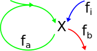

We analyze the simple auto-catalytic cycle depicted below.



Our analysis focuses on the concentration of the metabolite $C_1$, if it is at a steady state, and if the steady state is stable.
We note that $f_i$ and $f_a$ increase the concentration of $C_1$, and $f_b$ decreases it.

The following plot shows $f_a$ and $f_b$ as a function of $K_{m,a}$,$K_{m,b}$,$V_{max,a}$, $V_{max,b}$, and $f_i$ as a pre-set parameter.
As $f_a+f_i$ represents the flux into $C_1$ and $f_b$ the flux out of $C_1$, any intersection between these two lines is a steady state point.

The stability of the steady state point is determined by the dynamics around it.
For $C=C_{st.st}+\Delta C$, if $f_b(C)>f_a(C)+f_i(C)$, then the excess metabolite will be drained out of the cycle and the steady state point is stable.
If $f_b(C)<f_a(C)+f_i(C)$ then excess metabolite will feed back into the auto-catalytic cycle further increasing $C_1$, making the steady-state point unstable.

```{r, echo=FALSE}
library(ggplot2)
library(reshape2)
library(fields)

inputPanel(
  sliderInput("fi", label = "$$f_i$$",
              min = 0, max = 1, value = 0.1, step = 0.1),
  sliderInput("Kma", label = "$$K_{m,a}$$",
              min = 0.1, max = 2, value = 1, step = 0.1),
  sliderInput("Kmb", label = "$$K_{m,b}$$",
              min = 0.1, max = 2, value = 2, step = 0.1),
  sliderInput("Va", label = "$$V_{max,a}$$",
              min = 0.1, max = 2, value = 1, step = 0.1),
  sliderInput("Vb", label = "$$V_{max,b}$$",
              min = 0.1, max = 2, value = 1.5, step = 0.1)
)

renderPlot({
  xs <- seq(0,10,0.1)
  fi <- input$fi
  fa <- input$Va*xs/(xs+input$Kma)
  fb <- input$Vb*xs/(xs+input$Kmb)
  data <- data.frame(xs = xs, fb = fb, fa = fa, fin = fa+fi)
  data <- melt(data,id=c("xs"))
  size = element_text(size=18)
  ssize = element_text(size=12)
  ggplot(data = data,aes(x=xs,y=value,colour=variable)) + geom_line() +
    xlab("[C]")+scale_y_continuous(limits=c(0,2))+ylab("flux")+
    scale_color_manual(name="Fluxes",values = c("red","green","cyan"),labels=c(expression(f[b]),
                                                                               expression(f[a]),
                                                                               expression(f[a]+f[i])))+
    guides(colour= guide_legend())+theme(legend.text=size,legend.title=size,axis.text=ssize,axis.title=size)
})

```

Next we want to investigate the fitness landscape produced by this cycle in the experimental setup of a chemostat.
Such a setup implies a constant growth rate, $g$, which is reflected in our system by a constant biomass flux, $f_b=g$.
The fitness in such a setup is determined by the concentration of the feeding metabolite, $X$, at which the pre-set growth rate is sustained.
The lower the concentration of $X$ at which a strain can grow at rate $g$, the higher the fitness of that strain.
To illustrate, if two strains, $S_1$ and $S_2$, are both able to grow at rate $g$, but $S_1$ sustains this rate at an outside metabolite concentration $X_1<X_2$, then it follows that at $X_2$, $S_1$ will grow at a faster rate than $S_2$ and will thus out-compete it in the chemostat.

We therefore replace the input flux, $f_i$, with the affinity of the transporter of $X$, $K_{m,i}$.
We assume membrane economics remain constant, as well as the catalytic rate of the transporter, and thus $V_{max,i}$ does not change during the evolution.

For simplicity, we set the units of measurement of flux and concentration in the system to be such that $K_{m,a}=1$ and $V_{max,a}=1$.
We note that this implies that fluxes and concentrations of the other parameters in the system are now measured relative to $K_{m,a}$ and $V_{max,a}$.

The following plot shows the fitness landscape as a function of $K_{m,i}$ and $K_{m,b}$.
For the growth rate, $g$, we pick an initial value of $1/2 < V_{max,a}$ to reflect the fact that semi-autotrophic strains can maintain growth in the chemostat even with no supplied carbon source $X$.
The maximum transporter capacity is set to $V_{max,i}=1.5$ reflecting the fact that at high-enough external metabolite concentration, the growth rate can be higher than the one dictated by the chemostat, as well as the one allowed by the auto-catalytic cycle alone.
Initially, $V_{max,b}=2>V_{max,i}$, implying that even at high concentration of the external metabolite, the biomass reaction is not saturated, meaning high concentrations of $X$ will not cause the cycle to explode. All of these parameters can be modified below to see their effect on the generated fitness landscape.

We plot the value of $-\log(X)$ to extend the dynamic range and make higher values represent higher fitness.
Non-feasible solutions are painted white.

```{r, echo=FALSE}
inputPanel(
  sliderInput("g", label = "$$g$$",
              min = 0, max = 2, value = 1, step = 0.1),
  sliderInput("vi", label = "$$V_{max,i}$$",
              min = 0, max = 2, value = 1, step = 0.1),
  sliderInput("vb", label = "$$V_{max,b}$$",
              min = 0.1, max = 2, value = 1.5, step = 0.1)
)


is.stable <- function(x,v,k) {
    if(!is.finite(x)) return(FALSE)
    if(x<=0) return(FALSE)
    return((v/(x+k)-v*x/((x+k)^2))>(1/(x+1)-1*x/((x+1)^2)))
}

renderPlot({
  matsize = 20
  scale = 10
  g <- input$g
  Vi <- input$vi
  Vb <- input$vb
  Va <- 1
  Kma <- 1
  rc <- matrix(nrow=matsize,ncol=matsize)
  ks = seq(matsize)
  for(ki in ks)
      for(kb in ks) {
          Kmi <- ki/scale
          Kmb <- kb/scale
          c <- g*Kmb/(Vb-g)
          fa <- c*Va/(c+Kma)
          fi <- g-fa
          x <- fi*Kmi/(Vi-fi)
          if(!is.finite(c)) { rc[ki,kb] <- NaN
          } else if(c<0) { rc[ki,kb] <- NaN
          } else if(fi<0) {rc[ki,kb] <- NaN
          } else if((Vb/(c+Kmb)-Vb*c/((c+Kmb)^2))<(1/(c+1)-1*c/((c+1)^2))) { rc[ki,kb] <- NaN
          } else rc[ki,kb] <- -log(x)
      }
  par(mar=c(4,6,4,4))
  image.plot(x=ks/scale,y=ks/scale,rc,xlab = expression(K["m,i"]),ylab = expression(K["m,b"]), cex.lab = 2)
})
```
